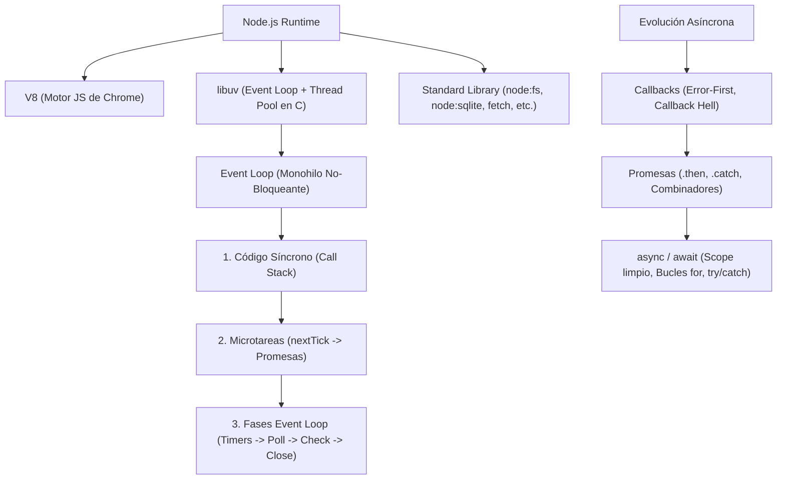
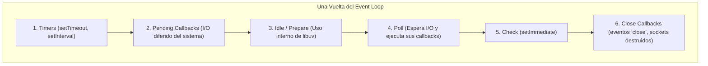
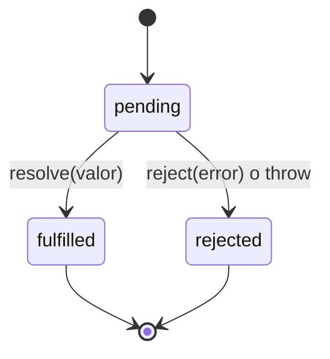

# 🎓 GUÍA MAESTRA DE ESTUDIO — EXAMEN DE TECNOLOGÍAS AVANZADAS
> **Universidad San Jorge** · Grado en Ingeniería Informática  
> **Tema 1:** Fundamentos de Node.js, Event Loop y Programación Asíncrona  
> **Profesor:** Raúl Novoa · **Curso:** 2026–27  
> **Material de referencia:** Diapositivas (`01-pptx`), Prácticas (`fundamentals/`, `async/`) y Proyecto (`project/`).

---

## 📑 ÍNDICE DE CONTENIDOS
1. [Mapa Conceptual y Qué se Evalúa en el Examen](#1-mapa-conceptual-y-qué-se-evalúa-en-el-examen)
2. [Bloque 1: Fundamentos de Node.js (T1-2)](#2-bloque-1-fundamentos-de-nodejs-t1-2)
   - 2.1. Anatomía de Node.js ("Tres cosas en una gabardina")
   - 2.2. Navegador vs Servidor: ¿Qué cambia y qué se comparte?
   - 2.3. Monohilo y No Bloqueante (Single-threaded & Non-blocking)
   - 2.4. Bloquear el Event Loop: Causas, consecuencias y soluciones
   - 2.5. Sistemas de Módulos: CommonJS (.cjs) vs ES Modules (.mjs)
   - 2.6. Resolución de Especificadores de Módulos
   - 2.7. npm y Gestión de Proyectos (`package.json`, SemVer y Lockfile)
   - 2.8. Herramientas Nativas Modernas de Node.js
   - 2.9. Comunicación con el Exterior (`process.argv`, `process.env`, Códigos de Salida)
3. [Bloque 2: El Event Loop y Orden de Ejecución (¡Pregunta Segura de Examen!)](#3-bloque-2-el-event-loop-y-orden-de-ejecución-pregunta-segura-de-examen)
   - 3.1. Las 6 Fases de una Vuelta de Event Loop (libuv)
   - 3.2. Microtareas vs Macrotareas: La Prioridad Absoluta
   - 3.3. `process.nextTick` vs `Promise.then`
   - 3.4. La Gran Trampa: `setTimeout(..., 0)` vs `setImmediate()`
   - 3.5. Ejercicios Resueltos de Predicción de Salida
4. [Bloque 3: Asincronía en Node.js — De Callbacks a async/await (T1-3)](#4-bloque-3-asincronía-en-nodejs--de-callbacks-a-asyncawait-t1-3)
   - 4.1. ¿Por qué existe la asincronía y por qué nacieron los Callbacks?
   - 4.2. La Convención "Error-First Callback" y sus Reglas Sagradas
   - 4.3. Callback Hell: El Verdadero Problema (Lectura inversa y repetición)
   - 4.4. Promesas: Qué son, los 3 Estados y su Inmutabilidad
   - 4.5. Producir vs Consumir Promesas
   - 4.6. Encadenamiento de Promesas (Chaining) y Reglas de Retorno
   - 4.7. Propagación de Errores, Recuperación con Fallback y `Error({ cause })`
   - 4.8. `async` / `await`: Reglas, Pausa de Función vs Pausa de Hilo y Manejo de Errores
   - 4.9. Por qué ganó `async/await`: Scope, Bucles y `try/catch/finally`
5. [Bloque 4: Concurrencia y Combinadores de Promesas](#5-bloque-4-concurrencia-y-combinadores-de-promesas)
   - 5.1. ¿Secuencial o Concurrente? El Criterio de Decisión
   - 5.2. Los 4 Combinadores: `all`, `allSettled`, `race` y `any`
   - 5.3. ¿Dónde compensa la concurrencia? Red vs Disco local
6. [Bloque 5: I/O en la Práctica con la Librería Estándar](#6-bloque-5-io-en-la-práctica-con-la-librería-estándar)
   - 6.1. Sistema de Ficheros: `node:fs/promises`, Codificación UTF-8 y Manejo de `ENOENT`
   - 6.2. Peticiones HTTP con `fetch` Nativo: Errores 4xx/5xx y `AbortSignal.timeout`
   - 6.3. Base de Datos SQLite con `node:sqlite`: Por qué es síncrona, Placeholders `?` y Transacciones
7. [Bloque 6: El Proyecto Integrador de la Sesión en Vivo](#7-bloque-6-el-proyecto-integrador-de-la-sesión-en-vivo)
   - 7.1. Los 7 Pasos del Importador
   - 7.2. Comparativa del Bucle Asíncrono: Recursión vs `reduce` vs `for...of`
   - 7.3. Manejo de Errores con Archivos Rotos
8. [Bloque 7: Banco de Preguntas Típicas de Examen (Con Solución)](#8-bloque-7-banco-de-preguntas-típicas-de-examen-con-solución)
9. [Bloque 8: Chuleta Rápida de Repaso (Cheat Sheet)](#9-bloque-8-chuleta-rápida-de-repaso-cheat-sheet)

---

# 1. MAPA CONCEPTUAL Y QUÉ SE EVALÚA EN EL EXAMEN

El examen evalúa fundamentalmente tres pilares:
1. **Comprensión Arquitectónica:** Cómo funciona Node.js por dentro (V8, libuv, Event Loop, monohilo, por qué no bloqueamos el hilo, cómo se gestionan módulos y proyectos).
2. **Capacidad de Predicción y Traza de Código:** Predecir con exactitud el orden en el que se imprimen mensajes en consola mezclando código síncrono, `nextTick`, promesas, temporizadores e I/O.
3. **Evolución y Escritura de Código Asíncrono:** Reescribir y comparar flujos asíncronos en Callbacks, Promesas y `async/await`, gestionando errores, alcances de variables (*scopes*), bucles y concurrencia con combinadores.



---

# 2. BLOQUE 1: FUNDAMENTOS DE NODE.JS (T1-2)

## 2.1. Anatomía de Node.js ("Tres cosas en una gabardina")
Node.js **no es un lenguaje de programación** (el lenguaje es JavaScript) ni un framework web. Es un **entorno de ejecución (runtime)** compuesto por tres componentes esenciales:

1. **V8:** El motor de JavaScript de código abierto desarrollado por Google para Chrome. Se encarga de compilar el código JavaScript a código máquina y ejecutarlo. El soporte de sintaxis (clases, flechas, desestructuración) proviene de V8.
2. **libuv:** Una librería multiplataforma escrita en C. Proporciona el **bucle de eventos (Event Loop)**, una cola de tareas y un **pool de hilos de fondo (Thread Pool de 4 hilos por defecto)**. Abstrae el I/O asíncrono del sistema operativo (`epoll` en Linux, `kqueue` en macOS, `IOCP` en Windows).
3. **Librería Estándar (`node:*`):** Módulos nativos integrados en C++ y JavaScript que dan acceso al hardware y sistema operativo: sistema de archivos (`node:fs`), red (`node:net`, `node:http`), criptografía (`node:crypto`), streams, procesos hijos (`node:child_process`), bases de datos (`node:sqlite`) y el corredor de pruebas (`node:test`).

> **Consecuencia de examen:** Todo lo que sabes de JavaScript estándar se mantiene idéntico. Lo único que cambia es el **entorno circundante**.

---

## 2.2. Navegador vs Servidor: ¿Qué cambia y qué se comparte?

| Característica | En el Navegador | En Node.js (Servidor) |
|---|---|---|
| **Objetos Globales** | `window`, `document`, `localStorage`, `alert` | `process`, `Buffer`, `__dirname`, `__filename`, `global` |
| **Acceso al Sistema** | Aislado en sandbox; sin acceso al disco duro local | Acceso completo a disco, procesos, puertos de red y sockets |
| **Modelo de Usuarios** | 1 usuario, 1 pestaña, 1 sesión | 1 único proceso atendiendo a cientos o miles de usuarios |
| **Tamaño del Código** | Crítico: se envía por la red al cliente (bundle size) | Menos crítico: el código reside en el servidor |
| **Punto Común** | El lenguaje JS, objetos estándar (`Array`, `Object`, `Date`), Promesas, `async/await` y la API `fetch` (incorporada en Node desde v18). |

---

## 2.3. Monohilo y No Bloqueante (Single-threaded & Non-blocking)
Dos conceptos que parecen contradictorios pero conviven en armonía:

1. **Monohilo (*Single-threaded*):** Tu código JavaScript se ejecuta en un único hilo de ejecución. **Dos líneas de tu código JS nunca se ejecutan al mismo tiempo.** No hay condiciones de carrera sobre variables en memoria ni necesidad de bloqueos con mutex en JS.
2. **No bloqueante (*Non-blocking*):** Cuando tu código solicita una operación lenta (leer un archivo de 2 GB, esperar respuesta de una base de datos o llamada HTTP), **no se queda congelado esperando**. Registra un callback en libuv y cede el control inmediatamente.
3. **¿Quién hace la espera?** `libuv`. Aprovecha los mecanismos asíncronos del núcleo del SO. Cuando el dato está listo en el SO, libuv encola el callback para que el Event Loop lo ejecute cuando el hilo principal esté libre.

> 🔴 **Regla de Oro:** **"Esperar es gratis; computar no lo es."**  
> Si mantienes el hilo ocupado calculando, ningún otro usuario podrá ser atendido en ese proceso.

---

## 2.4. Bloquear el Event Loop: Causas, consecuencias y soluciones

### ¿Qué ocurre cuando se bloquea?
- Un temporizador programado para dentro de 100 ms se dispara con segundos de retraso.
- Las peticiones HTTP entrantes se encolan; la latencia se dispara, los health checks fallan y el servidor parece caído.

### Culpables típicos de bloqueo de CPU:
- Bucles gigantescos síncronos (`for` de millones de iteraciones).
- `JSON.parse` o `JSON.stringify` sobre objetos gigantes (cientos de megabytes).
- Funciones síncronas del sistema de ficheros (`fs.readFileSync`, `fs.writeFileSync`).
- Criptografía pesada ejecutada síncronamente o algoritmos de compresión.
- Expresiones regulares con *catastrophic backtracking* (búsquedas exponenciales).

### Soluciones para trabajo intensivo de CPU:
1. **`node:worker_threads`:** Mover el cálculo a un hilo secundario real con memoria compartida/mensajería.
2. **`node:child_process`:** Delegar la tarea en un subproceso independiente del sistema operativo.
3. **Trocear el trabajo (*Chunking*) con `setImmediate()`:** Dividir un cálculo masivo en bloques y ceder el hilo con `setImmediate` entre bloques para permitir que el Event Loop atienda I/O pendiente.
4. **Arquitectura externa:** Sacar el trabajo fuera de la API a una cola de mensajes (RabbitMQ, Redis, Kafka) con trabajadores dedicados.

> 💡 **Máxima:** Node.js es sobresaliente en tareas **I/O-bound** (mucho tráfico de datos, poca CPU) y mediocre en tareas **CPU-bound** (cálculo matemático puro). Casi todas las APIs comerciales son I/O-bound.

---

## 2.5. Sistemas de Módulos: CommonJS (.cjs) vs ES Modules (.mjs)

Node.js convive con dos sistemas de módulos:

| Criterio | CommonJS (CJS) | ES Modules (ESM) |
|---|---|---|
| **Origen** | El sistema nativo original de Node.js (2009) | El estándar oficial de ECMAScript / JS |
| **Importación** | `const { foo } = require('./foo');` | `import { foo } from './foo.mjs';` |
| **Exportación** | `module.exports = { foo };` | `export function foo() {}` / `export default foo;` |
| **Carga** | **Síncrona y dinámica** (se puede hacer `require()` dentro de un `if` o bucle) | **Estática** (se resuelve antes de ejecutar el código; permite *tree-shaking*) |
| **Rutas y carpetas** | Variables globales: `__dirname` y `__filename` | Objeto meta: `import.meta.dirname` y `import.meta.filename` |
| **Top-level await** | ❌ No permitido directamente en la raíz | ✅ Totalmente permitido en la raíz del archivo |
| **Extensiones** | Opcional (Node deduce `.js`, `.json`) | **Obligatoria** (debes poner `./foo.mjs` o `./foo.js`) |
| **Cómo lo activa Node** | Por defecto para `.js` sin `"type"` o archivos `.cjs` | Al poner `"type": "module"` en `package.json` o usar `.mjs` |

### Buenas prácticas de importación:
1. **Prefijo `node:`:** Importar siempre los módulos nativos como `node:fs`, `node:path`, `node:sqlite`. Evita colisiones si alguien publica un paquete con el mismo nombre en npm.
2. **Extensión en ESM:** En ESM relativo, incluir siempre la extensión (`./greeter.mjs`), de lo contrario fallará.

---

## 2.6. Resolución de Especificadores de Módulos
Existen 3 tipos de importaciones según cómo esté escrito el especificador:

1. **Módulo nativo (`node:fs`):** Se resuelve al instante en memoria. Jamás toca el disco duro. El prefijo `node:` garantiza que ningún paquete de terceros pueda suplantarlo.
2. **Ruta relativa (`./utils.mjs` o `../lib/db.js`):** Se resuelve con respecto a la ubicación del archivo que hace el import. En ESM la extensión es estrictamente obligatoria; en CJS se prueba con extensiones conocidas.
3. **Especificador simple o de paquete (*Bare specifier*, ej: `express`):** Node busca la carpeta `node_modules/express` en el directorio actual. Si no está, sube a la carpeta padre, y a la siguiente, hasta alcanzar la raíz del sistema.
   - *¿Por qué el error dice `Cannot find module 'express'` en lugar de `file not found`?* Porque Node subió por todo el árbol buscando carpetas `node_modules` y no encontró el paquete.

---

## 2.7. npm y Gestión de Proyectos (`package.json`, SemVer y Lockfile)

### npm son 3 conceptos con el mismo nombre:
1. **El Registro:** Archivo público en `npmjs.com` con millones de paquetes.
2. **La Herramienta CLI:** Comando `npm` incluido con Node.js (`npm install`, `npm test`, `npm run`).
3. **El Formato de Manifiesto:** El fichero `package.json` que describe el proyecto.

### Campos clave de `package.json`:
- `"type": "module"`: Define que todos los ficheros `.js` del proyecto se traten como ES Modules.
- `"engines": { "node": ">=24" }`: Documenta qué versión de Node requiere el proyecto.
- `"dependencies"`: Paquetes necesarios para **ejecutar** la aplicación en producción (ej. `express`).
- `"devDependencies"`: Paquetes necesarios solo durante el **desarrollo y compilación** (ej. `eslint`, linters).
- `"scripts"`: Comandos de acceso directo del proyecto (`npm run start`, `npm run dev`, `npm test`).

### Versionado Semántico (SemVer: `MAJOR.MINOR.PATCH`):
Dado `5.1.0`:
- **`MAJOR` (5):** Cambios que rompen compatibilidad (*breaking changes*).
- **`MINOR` (1):** Nuevas funcionalidades compatibles hacia atrás.
- **`PATCH` (0):** Correcciones de bugs compatibles hacia atrás.

Prefijos de rango en `package.json`:
- `^5.1.0` (Caret): Acepta cualquier `5.x.x` (hasta `<6.0.0`). No acepta cambio mayor.
- `~5.1.0` (Tilde): Acepta solo parches `5.1.x` (hasta `<5.2.0`).
- `5.1.0` (Exacto): Instala exactamente esa versión.

### `package-lock.json` vs `npm ci`:
- `package-lock.json` registra el árbol de dependencias **exacto al milímetro** (versión fija de cada subdependencia y hash de integridad).
- **Debe commitearse siempre en Git.** Evita el problema *"en mi máquina funciona"*, provocado cuando una librería menor publica una versión con bugs entre instalaciones distintas.
- En entornos de Integración Continua (CI) y producción, se usa **`npm ci`** en lugar de `npm install`. `npm ci` borra `node_modules`, ignora los rangos `^` y se ciñe 100% al lockfile.

---

## 2.8. Herramientas Nativas Modernas de Node.js
Node.js moderno (v22/v24) ha absorbido utilidades que antes requerían librerías de terceros:

| Herramienta Clásica de npm | Equivalente Nativo en Node.js 22/24 | Comando / Flag |
|---|---|---|
| `nodemon` | Modo observación nativo | `node --watch src/index.js` |
| `dotenv` | Carga nativa de variables `.env` | `node --env-file=.env src/index.js` |
| `jest` / `mocha` | Test runner integrado | `node --test` |
| `ts-node` | Ejecución nativa de ficheros TypeScript | `node src/index.ts` *(extrae tipos sintácticamente sin type-checking)* |
| `sqlite3` | Motor de base de datos SQLite integrado | `import { DatabaseSync } from 'node:sqlite'` |
| `axios` / `node-fetch` | Cliente HTTP global estándar | `fetch(url)` nativo |

---

## 2.9. Comunicación con el Exterior (`process.argv`, `process.env`, Códigos de Salida)

El objeto global `process` comunica tu código con el shell del sistema operativo:

### 1. Argumentos de Línea de Comandos (`process.argv`):
Si ejecutas `node script.js Alice 3`:
- `process.argv[0]`: Ruta absoluta al binario `node` de tu ordenador.
- `process.argv[1]`: Ruta absoluta al script `script.js`.
- `process.argv[2]`: `'Alice'` (primer argumento real del usuario).
- `process.argv[3]`: `'3'` (segundo argumento real del usuario, siempre como texto).
- **Patrón estándar:** `const [name, times = '1'] = process.argv.slice(2);`

### 2. Variables de Entorno (`process.env`):
- Diccionario de valores del sistema. Se utiliza para configuración sensible (puertos, tokens, URLs de BD) que **nunca debe estar hardcodeada** en el código fuente.
- Lectura segura con operador nullish: `const port = process.env.PORT ?? 3000;`

### 3. Códigos de Salida (*Exit Codes*):
- `0`: Éxito total.
- `1` (o distinto de 0): Fallo. Indica a scripts externos, Docker y pipelines de CI/CD que el proceso falló.
- Se puede invocar con `process.exit(1)` (terminación abrupta) o asignando `process.exitCode = 1;` (deja que el Event Loop termine las tareas pendientes antes de salir con error).

### 4. Salidas estándar:
- `stdout` (`console.log`): Para los datos que el programa produce.
- `stderr` (`console.error`): Para diagnósticos, avisos y errores. Mantenerlos separados permite redirigir salidas en el terminal (`node script.js > resultado.txt 2> errores.log`).

---

# 3. BLOQUE 2: EL EVENT LOOP Y ORDEN DE EJECUCIÓN (¡PREGUNTA SEGURA DE EXAMEN!)

## 3.1. Las 6 Fases de una Vuelta de Event Loop (libuv)
El Event Loop es un bucle infinito que itera en orden estricto por las siguientes fases en cada vuelta (*turn* o *tick*), vaciando sus respectivas colas de callbacks:



1. **Timers:** Ejecuta callbacks programados por `setTimeout()` y `setInterval()` cuyo umbral de tiempo ya ha vencido.
2. **Pending callbacks:** Ejecuta callbacks de errores del sistema operativo pospuestos de la vuelta previa (ej. errores de red `ECONNREFUSED`).
3. **Idle, prepare:** Uso interno exclusivo de libuv (invisible para el desarrollador).
4. **Poll:** **Donde el bucle pasa la mayor parte de su vida.** Consulta al SO por I/O completado (lectura de disco, peticiones de red) y ejecuta sus callbacks. Si no hay nada listo, espera aquí.
5. **Check:** Ejecuta exclusivamente los callbacks registrados con `setImmediate()`.
6. **Close callbacks:** Ejecuta callbacks de cierre, por ejemplo `socket.on('close', ...)`.

---

## 3.2. Microtareas vs Macrotareas: La Prioridad Absoluta

> ⚠️ **REGLA FUNDAMENTAL DE EXAMEN:**  
> **Las microtareas NO son una fase del Event Loop.**  
> Tienen prioridad absoluta sobre cualquier fase y se vacían **después de CADA callback individual**, no una vez por vuelta.

El orden de resolución es:
1. **Pila de llamadas principal (Call Stack):** Todo el código síncrono corre hasta el final sin interrupciones.
2. **Cola de Microtareas:**
   - **Prioridad 1:** `process.nextTick()` (se cuela por delante de todo).
   - **Prioridad 2:** Promesas resueltas (`Promise.resolve().then(...)`, `await`).
3. **Fases del Event Loop (Macrotareas):** Timers, Poll, Check, etc.
4. **Tras cada callback ejecutado en cualquier fase:** Se vuelve a comprobar y vaciar la cola de microtareas.

---

## 3.3. `process.nextTick` vs `Promise.then`
Ambos encolan microtareas, pero `process.nextTick` tiene una cola propia de mayor prioridad gestionada directamente por Node.js antes de la cola de Promesas de V8.

```javascript
Promise.resolve().then(() => console.log('promesa'));
process.nextTick(() => console.log('nextTick'));
// Salida:
// 1. nextTick
// 2. promesa
```

---

## 3.4. La Gran Trampa: `setTimeout(..., 0)` vs `setImmediate()`

Esta es una de las preguntas teóricas y prácticas más recurrentes en exámenes:

### Caso A: En el módulo principal (raíz del archivo)
```javascript
setTimeout(() => console.log('timeout'), 0);
setImmediate(() => console.log('immediate'));
```
- **Resultado:** **NO ES DETERMINISTA.** Puede salir `timeout` luego `immediate`, o al revés.
- **¿Por qué?** Porque `setTimeout(fn, 0)` en Node.js internamente se convierte en `setTimeout(fn, 1)` (1 ms de umbral mínimo). Dependiendo de la carga del procesador y el tiempo que tarde el proceso de Node en arrancar, al llegar a la fase de *Timers* puede haber transcurrido más de 1 ms (ejecutando `timeout`) o menos de 1 ms (saltando a *Poll* y luego a *Check*, ejecutando `immediate`).

### Caso B: Dentro de un callback de I/O (fase Poll)
```javascript
const fs = require('node:fs');
fs.readFile(__filename, () => {
  setTimeout(() => console.log('timeout'), 0);
  setImmediate(() => console.log('immediate'));
});
```
- **Resultado:** **100% DETERMINISTA. `setImmediate` SIEMPRE gana.**
- **¿Por qué?** Cuando el callback de `fs.readFile` se está ejecutando, el Event Loop se encuentra en la fase **Poll**. La siguiente fase inmediata según el ciclo de libuv es la fase **Check** (donde vive `setImmediate`). Para llegar a `setTimeout`, el bucle tendría que completar la vuelta entera. Por tanto, `immediate` se ejecuta siempre antes que `timeout`.

---

## 3.5. Ejercicios Resueltos de Predicción de Salida

### Ejercicio 1 (Del archivo `fundamentals/02-eventloop-order.js`):
```javascript
console.log('1 — sync start');

setTimeout(() => console.log('timers — setTimeout 0'), 0);
setImmediate(() => console.log('check — setImmediate'));

Promise.resolve().then(() => console.log('4 — promise'));
process.nextTick(() => console.log('3 — nextTick'));

console.log('2 — sync end');
```

**Solución paso a paso:**
1. Se ejecuta el código síncrono línea a línea:
   - Imprime: `1 — sync start`
   - Registra temporizador en fase Timers.
   - Registra callback en fase Check.
   - Encola microtarea de promesa.
   - Encola microtarea `nextTick`.
   - Imprime: `2 — sync end`
2. El Call Stack queda vacío. Node vacía las microtareas:
   - `process.nextTick` tiene prioridad máxima -> Imprime: `3 — nextTick`
   - Microtareas de promesas -> Imprime: `4 — promise`
3. Node entra en las fases del Event Loop:
   - Desde la raíz, `timers` o `check` se ejecutan según el milisegundo de inicio del proceso.
   - Imprime: `timers — setTimeout 0` y `check — setImmediate` (en cualquier orden entre ellos).

---

# 4. BLOQUE 3: ASINCRONÍA EN NODE.JS — DE CALLBACKS A ASYNC/AWAIT (T1-3)

## 4.1. ¿Por qué existe la asincronía y por qué nacieron los Callbacks?
Una función que espera al disco duro o a la red **no puede devolver su resultado con `return`**, porque en el instante en que la función retorna, el dato físico aún no existe.

En lugar de devolver el valor, acepta una función por parámetro y promete llamarla en el futuro cuando el valor esté disponible. Esa función es el **callback**.

```javascript
// La llamada sólo registra interés y sigue su camino:
op((resultado) => {
  console.log('4 — resultado recibido:', resultado);
});
console.log('2 — sigo trabajando mientras espero');
```
*Frase nemotécnica:* **"Haz esto, y cuando hayas terminado, ejecuta aquello."**

---

## 4.2. La Convención "Error-First Callback" y sus Reglas Sagradas
Node.js estableció el estándar de firmas de callbacks:
```javascript
callback(err, data)
```
1. **Regla 1 (El error es el primer parámetro):** Si la operación tiene éxito, `err` es `null` o `undefined` y `data` contiene el resultado (`callback(null, data)`).
2. **Regla 2 (Objeto `Error`, nunca un string):** Pasa siempre `new Error('mensaje')`, jamás un string simple. Pasar un string destruye la traza de pila (*stack trace*).
3. **Regla 3 (Hacer siempre `return`):**
   ```javascript
   if (err) {
     console.error(err.message);
     return; // ¡VITAL! Sin este return, la ruta de éxito también se ejecutaría
   }
   ```
4. **Regla 4 (`try/catch` no sirve con callbacks asíncronos):**
   ```javascript
   try {
     fs.readFile('no-existe.txt', (err, data) => {
       // El error llega en el parámetro err.
     });
   } catch (e) {
     // ¡ESTO NUNCA CAPTURA NADA! fs.readFile ya terminó de ejecutarse 
     // en la pila síncrona mucho antes de que el error ocurra en el Event Loop.
   }
   ```

---

## 4.3. Callback Hell: El Verdadero Problema (Lectura inversa y repetición)
El problema de anidar callbacks (*Callback Hell* o *Pyramid of Doom*) no es puramente estético:
1. **Lectura inversa:** El código se lee de dentro hacia fuera y se desplaza hacia la derecha.
2. **Duplicación de gestión de errores:** Cada nivel de indentación debe repetir `if (err) return callback(err);`. Si olvidas uno, el fallo desaparece silenciosamente.
3. **Imposibilidad de paralelismo nativo:** No hay sintaxis sencilla para decir "haz estas dos operaciones a la vez y avísame cuando ambas terminen".
4. **Bucles asíncronos infernales:** Un bucle `for` no espera a un callback; para hacer un bucle asíncrono con callbacks estás obligado a escribir una **función recursiva manual** (`function next() { ... }`).
5. **Falta de garantías:** Nada en el lenguaje impide que un callback mal programado sea llamado 2 veces o ninguna.

---

## 4.4. Promesas: Qué son, los 3 Estados y su Inmutabilidad
Una Promesa es un **objeto que representa el resultado eventual de una operación asíncrona**.

### Los 3 Estados:
- **`pending` (Pendiente):** La operación está en curso. Es el estado en el momento en que se crea la promesa.
- **`fulfilled` (Cumplida / Resuelta):** La operación tuvo éxito (`resolve(valor)`). Dispara los `.then()`.
- **`rejected` (Rechazada):** La operación falló (`reject(error)` o se lanzó una excepción no capturada). Dispara los `.catch()`.



> **Principio de Inmutabilidad:** Una promesa pasa de `pending` a un estado final **exactamente una sola vez**. Una vez liquidada (*settled*), su valor o error jamás cambia. Es un valor seguro que puedes guardar en variables, pasar a funciones o escuchar múltiples veces.

---

## 4.5. Producir vs Consumir Promesas

- **Producir (`new Promise((resolve, reject) => ...)`):**
  - Solo se escribe al envolver librerías antiguas basadas en callbacks que no tienen versión de promesas.
  - *Regla:* Nunca envuelvas lo que la plataforma ya envolvió (ej. `node:fs/promises` ya existe; `util.promisify` convierte callbacks automáticamente).
- **Consumir (`.then()`, `.catch()`, `.finally()` o `await`):**
  - Es lo que se programa a diario con APIs modernas.

---

## 4.6. Encadenamiento de Promesas (Chaining) y Reglas de Retorno
Permite que el código crezca verticalmente hacia abajo en lugar de horizontalmente:

```javascript
findUser('Alice')
  .then((user) => findOrdersOf(user))
  .then((orders) => findInvoiceOf(orders[0]))
  .then((invoice) => markAsPaid(invoice))
  .then((paid) => console.log('done:', paid))
  .catch((err) => console.error('Falló la secuencia:', err.message));
```

### Reglas de Oro del Chaining:
1. **Lo que retornas en un `.then()` alimenta al siguiente `.then()`.**
2. **Si retornas una Promesa:** La cadena se pausa automáticamente y espera a que esa promesa se resuelva antes de pasar al siguiente `.then()`.
3. **⚠️ El error clásico:** Olvidar el `return`. Si olvidas poner `return findOrdersOf(user);`, el siguiente `.then()` recibirá `undefined` de inmediato sin esperar.
4. **Un único `.catch()` al final** captura cualquier fallo producido en cualquiera de los pasos anteriores.
5. **El defecto del Chaining (Por qué necesitábamos `async/await`):** El **Scope**. Cada `.then()` es una función independiente. La variable `user` del paso 1 **no está disponible en el paso 4** a menos que declares variables `let` en un ámbito exterior o vuelvas a anidar.

---

## 4.7. Propagación de Errores, Recuperación con Fallback y `Error({ cause })`

1. **Salto de pasos:** Si ocurre un rechazo, se saltan todos los `.then()` intermedios hasta encontrar el primer `.catch()`.
2. **Recuperación con Fallback:**
   ```javascript
   fetchDeCache()
     .catch((err) => {
       console.log('Fallo de caché, usando fallback');
       return { datos: 'por defecto' }; // ¡La cadena se RECUPERA!
     })
     .then((resultado) => {
       // Este .then() se ejecuta normalmente recibiendo el fallback
     });
   ```
3. **Relanzar con causa (`Error({ cause })`):** Permite añadir contexto de negocio sin perder la traza original:
   ```javascript
   .catch((err) => {
     throw new Error('No se pudo cargar el informe', { cause: err });
   });
   ```
4. **`unhandledRejection`:** En Node.js moderno, una promesa rechazada que no tenga un `.catch()` emite un evento y **termina el proceso de Node con error**. No lo uses para control de flujo; es solo una red de seguridad para logging de emergencia.

---

## 4.8. `async` / `await`: Reglas, Pausa de Función vs Pausa de Hilo y Manejo de Errores

`async / await` no es un mecanismo nuevo en el runtime; compila internamente a las mismas promesas:

1. **Toda función `async` devuelve SIEMPRE una Promesa.** Si retornas un número (`return 42`), Node lo envuelve automáticamente en `Promise.resolve(42)`.
2. **`await` pausa SOLO esa función:** Detiene la ejecución dentro del cuerpo de la función hasta que la promesa se resuelva, pero **el hilo de Node queda libre** para seguir atendiendo a otros usuarios y eventos.
3. **Los rechazos vuelven a ser excepciones:** Puedes usar `try / catch / finally` estándar de toda la vida.
4. **Top-Level Await:** En ES Modules (`.mjs` o `"type": "module"`), puedes hacer `await` directamente en la raíz del script sin envolverlo en una función `async main()`.

---

## 4.9. Por qué ganó `async/await`: Scope, Bucles y `try/catch/finally`

| Aspecto | Con Callbacks | Con Promesas (`.then`) | Con `async / await` |
|---|---|---|---|
| **Alcance (*Scope*)** | Variable atrapada en closures anidados | Cada `.then()` tiene su propia función; necesitas variables `let` fuera | **Variables locales ordinarias.** El valor del paso 1 sigue en ámbito en el paso 5. |
| **Bucles Asíncronos** | Función recursiva manual (`next()`) | `.reduce()` encadenando promesas | **Bucle `for (const item of items) await ...` real.** |
| **Limpieza de Recursos** | Callback de cierre repetido en cada salida | `.finally()` | Bloque **`finally`** estándar una sola vez. |

---

# 5. BLOQUE 4: CONCURRENCIA Y COMBINADORES DE PROMESAS

## 5.1. ¿Secuencial o Concurrente? El Criterio de Decisión

> ❓ **La Pregunta Decisiva:** **¿Necesita este paso el resultado del paso anterior?**
> - **SI lo necesita:** Debe ser **Secuencial** (`await paso1(); await paso2();`).
> - **NO lo necesita:** Estás perdiendo el tiempo si esperas uno a uno. Debes lanzarlos en **Concurrente**.
> - **Excepción de escrituras:** Si el orden de escritura en una base de datos o archivo único importa, debe ser secuencial aunque sean operaciones independientes.

```javascript
// ❌ ERROR TÍPICO: 600 ms desperdiciados esperando tareas independientes
const a = await delay(300);
const b = await delay(300);

// ✅ CONCURRENTE: 300 ms en total
const [a, b] = await Promise.all([delay(300), delay(300)]);
```

---

## 5.2. Los 4 Combinadores: `all`, `allSettled`, `race` y `any`

Tabla de estudio indispensable para el examen:

| Combinador | Condición de Éxito | Comportamiento ante Fallo | ¿Cuándo usarlo? |
|---|---|---|---|
| **`Promise.all`** | Se resuelve cuando **TODAS** tienen éxito. Devuelve array de resultados en el mismo orden. | **Falla rápida (*Fail-fast*):** En cuanto **UNA** falla, la promesa combinada se rechaza de inmediato con ese error. | Cuando necesitas que todas las partes estén presentes sí o sí (ej. cargar datos de usuario Y permisos). |
| **`Promise.allSettled`** | **NUNCA se rechaza.** Espera a que todas terminen (éxito o fallo). | Devuelve un array de objetos de estado: `{ status: 'fulfilled', value }` o `{ status: 'rejected', reason }`. | Informes por lotes donde el fallo parcial es información útil (ej. consultar 10 sensores y procesar los que respondieron). |
| **`Promise.race`** | Gana la **primera que termine**, ya sea con éxito o con error. | Si la primera que termina se rechaza, `race` se rechaza con ese error. | Patrón de límite de tiempo (*Timeout Guard*): competir tu petición contra un temporizador que rechaza a los 5s. |
| **`Promise.any`** | Gana la **primera que tenga ÉXITO**. Ignora los fallos intermedios. | Solo se rechaza si **ABSOLUTAMENTE TODAS fallan**, devolviendo un `AggregateError`. | Peticiones a servidores réplica o espejos (*mirrors*): quedarse con la primera fuente que responda correctamente. |

---

## 5.3. ¿Dónde compensa la concurrencia? Red vs Disco local
En la sesión en vivo se analiza un benchmark real:
- **Lectura de 3 archivos locales en disco:** Secuencial = 2 ms → Concurrente (`Promise.all`) = 1 ms. *(Apenas hay diferencia porque el disco local no tiene latencia apreciable).*
- **Consulta de 7 perfiles en API remota:** Secuencial = 1754 ms → Concurrente = 251 ms. *(¡Ahorro de más de 1.5 segundos!)*
- **Conclusión teórica:** La concurrencia compensa donde **la espera física es real** (latencia de red, servicios externos, sockets).

---

# 6. BLOQUE 5: I/O EN LA PRÁCTICA CON LA LIBRERÍA ESTÁNDAR

## 6.1. Sistema de Ficheros: `node:fs/promises`, Codificación UTF-8 y Manejo de `ENOENT`

Node ofrece tres sabores de operaciones de archivo:
1. `fs.readFile(path, cb)`: Estilo callbacks clásico.
2. `fs.readFileSync(path)`: Síncrono y bloqueante. *(Válido solo en scripts CLI iniciales de arranque; en un servidor web en producción es un bug grave que congela a todos los usuarios).*
3. `fsp.readFile(path, 'utf8')`: Estilo promesas con `node:fs/promises` (el que debes usar).

### Trampas críticas de archivos:
- **Buffer vs String:** Si no pasas `'utf8'` como segundo argumento a `readFile`, Node devuelve un objeto binario `Buffer` en vez de un texto legible.
- **Construcción de rutas:** Usa siempre `path.join(__dirname, 'carpeta', 'archivo.json')`, jamás concatenes barras (`'/'` o `'\\'`) a mano, ya que rompe la portabilidad entre Windows y Linux.
- **Comprobación de errores:** Comprueba siempre la propiedad `err.code` (`'ENOENT'` = archivo no existe, `'EACCES'` = permiso denegado), **nunca el texto `err.message`**, ya que el mensaje textual puede variar entre versiones del sistema operativo.
  ```javascript
  try {
    const raw = await fs.readFile(path, 'utf8');
  } catch (err) {
    if (err.code === 'ENOENT') {
      console.log('El archivo no existe');
    } else {
      throw err; // ¡Nunca te tragues errores imprevistos!
    }
  }
  ```

---

## 6.2. Peticiones HTTP con `fetch` Nativo: Errores 4xx/5xx y `AbortSignal.timeout`

Desde Node.js 18 `fetch` es nativo y global. Ya no se usan `axios`, `node-fetch` ni `request-promise-native` (obsoleto).

### Las dos trampas mortales de `fetch`:
1. **`fetch` NO rechaza la promesa ante un error 404 (Not Found) o 500 (Internal Server Error).** Para `fetch`, mientras el servidor HTTP responda bytes, la conexión de red triunfó. Estás obligado a comprobar `response.ok`:
   ```javascript
   const res = await fetch(url);
   if (!res.ok) {
     throw new Error(`HTTP Error: ${res.status} ${res.statusText}`);
   }
   const data = await res.json();
   ```
2. **Peticiones colgadas eternamente:** Si el servidor remoto no responde ni cierra la conexión, tu proceso se queda esperando para siempre. Se previene con `AbortSignal.timeout(ms)`:
   ```javascript
   const res = await fetch(url, {
     signal: AbortSignal.timeout(5000), // Aborta a los 5 segundos
   });
   ```

---

## 6.3. Base de Datos SQLite con `node:sqlite`: Por qué es síncrona, Placeholders `?` y Transacciones

Node.js v22.5+ incorpora `node:sqlite` sin instalar nada de npm.
```javascript
import { DatabaseSync } from 'node:sqlite';
const db = new DatabaseSync('app.db');
```

1. **¿Por qué `DatabaseSync` es síncrono y no usa `await`?**
   Una base de datos SQLite local en el mismo disco duro tarda microsegundos de CPU en responder; no existe latencia de red. Esperar asíncronamente añadiría sobrecarga inútil en el Event Loop. *(En contraste, una BD remota como PostgreSQL o MySQL sí es I/O de red y debe ser asíncrona).*
2. **Prevención de Inyección SQL:**
   - **NUNCA** concatenes cadenas: `db.prepare("SELECT * FROM users WHERE name = '" + name + "'")` ❌
   - **SIEMPRE** usa marcadores de posición (*placeholders*) `?`:
     ```javascript
     const stmt = db.prepare('INSERT INTO users (name) VALUES (?)');
     stmt.run('Alice');
     ```
3. **Transacciones atómicas:**
   ```javascript
   db.exec('BEGIN');
   try {
     stmt1.run();
     stmt2.run();
     db.exec('COMMIT'); // Todo correcto
   } catch (err) {
     db.exec('ROLLBACK'); // Deshace todo si algo falló
     throw err;
   }
   ```

---

# 7. BLOQUE 6: EL PROYECTO INTEGRADOR DE LA SESIÓN EN VIVO

## 7.1. Los 7 Pasos del Importador
El proyecto de clase consiste en construir un importador de lecturas de sensores con 7 pasos secuenciales:
1. Abrir base de datos SQLite y crear tabla si no existe.
2. Leer fichero JSON de lecturas del disco.
3. Parsear el JSON.
4. Validar e insertar cada lectura en la BD.
5. Consultar agregación SQL por región.
6. Escribir informe formateado en `out/report.txt`.
7. Cerrar la conexión a la base de datos.

---

## 7.2. Comparativa del Bucle Asíncrono: Recursión vs `reduce` vs `for...of`

Cómo se programa el paso 4 (insertar cada lectura en orden) en cada estilo:

### 1. Con Callbacks: Función recursiva manual
```javascript
function insertAll(db, readings, callback) {
  let index = 0;
  function next() {
    if (index >= readings.length) return callback(null);
    db.run(INSERT, params(readings[index++]), (err) => {
      if (err) return callback(err);
      next(); // Llamada recursiva al siguiente
    });
  }
  next();
}
```

### 2. Con Promesas: `Array.prototype.reduce`
```javascript
function insertAll(db, readings) {
  return readings.reduce(
    (prevPromise, reading) =>
      prevPromise.then(() => run(db, INSERT, params(reading))),
    Promise.resolve()
  );
}
```

### 3. Con `async / await`: Bucle `for...of` estándar
```javascript
async function insertAll(db, readings) {
  for (const reading of readings) {
    await run(db, INSERT, params(reading));
  }
}
```
> **Conclusión:** `async/await` permite utilizar las estructuras de control naturales del lenguaje (`for`, `while`) sin recurrir a gimnasia mental como la recursión o el `reduce`.

---

## 7.3. Manejo de Errores con Archivos Rotos

El proyecto incluye 4 archivos con fallos diseñados a propósito para probar la robustez:
1. `readings-broken.json`: JSON mal formado con error de sintaxis -> Capturado por `JSON.parse` en el bloque `catch`.
2. `readings-west.json`: Contiene una lectura con batería = -5 -> Capturado por la función `validate(reading)`.
3. `readings-duplicate.json`: Dos lecturas con la misma clave primaria `id` -> Capturado por la restricción `PRIMARY KEY` de SQLite al ejecutar el `INSERT`.
4. `does-not-exist.json`: El archivo no existe -> Capturado en `fs.readFile` con código de error `ENOENT`.

---

# 8. BLOQUE 7: BANCO DE PREGUNTAS TÍPICAS DE EXAMEN (CON SOLUCIÓN)

### P1: ¿Qué tres componentes forman la arquitectura interna de Node.js?
**Respuesta:**
1. **V8** (compila y ejecuta JavaScript).
2. **libuv** (gestiona el bucle de eventos, pool de hilos y el I/O asíncrono en C).
3. **Librería Estándar (`node:*`)** (módulos nativos como `fs`, `path`, `sqlite`, `crypto`).

---

### P2: ¿Por qué en Node.js no existen `window` ni `document`?
**Respuesta:**
Porque esos objetos pertenecen a la Web API implementada por los navegadores para representar la ventana gráfica y el árbol DOM. En el servidor no hay interfaz gráfica ni pantalla, por lo que Node proporciona globales orientados al sistema operativo como `process` y `Buffer`.

---

### P3: ¿Qué diferencia hay entre una tarea CPU-bound y una tarea I/O-bound, y cuál es el impacto de una tarea CPU-bound en Node.js?
**Respuesta:**
- **I/O-bound:** Pasa la mayor parte del tiempo esperando a dispositivos externos (disco, red, base de datos). Node delega la espera en libuv y libera el hilo principal.
- **CPU-bound:** Requiere cálculo continuo en el procesador. Al ser monohilo, secuestra el procesador y **bloquea el Event Loop**, impidiendo que cualquier otra petición o temporizador sea atendido hasta que finalice.

---

### P4: ¿Cuál es la salida exacta de este código?
```javascript
console.log('A');
setTimeout(() => console.log('B'), 0);
Promise.resolve().then(() => console.log('C'));
process.nextTick(() => console.log('D'));
console.log('E');
```
**Respuesta:**
```text
A
E
D
C
B
```
*Explicación:* Código síncrono (`A`, `E`), luego microtarea `process.nextTick` (`D`), luego microtarea de Promesa (`C`), y finalmente fase Timers del Event Loop (`B`).

---

### P5: ¿Por qué dentro de un callback de `fs.readFile`, `setImmediate` siempre se ejecuta antes que `setTimeout(fn, 0)`?
**Respuesta:**
Porque el callback de `fs.readFile` se ejecuta en la fase **Poll** del Event Loop. La fase inmediatamente siguiente en el ciclo de libuv es la fase **Check** (donde se procesan los callbacks de `setImmediate`). Para alcanzar `setTimeout`, el bucle tendría que completar la vuelta entera pasando por Close Callbacks y volviendo a Timers.

---

### P6: ¿Por qué falla un bloque `try / catch` tradicional alrededor de una llamada a una función con callback asíncrono?
**Respuesta:**
Porque la función asíncrona solo planifica la tarea y retorna inmediatamente. El bloque `try/catch` finaliza su ejecución en la pila síncrona. Cuando el callback se dispara en un turno futuro del Event Loop, el contexto del `try/catch` original ya no existe en la pila de llamadas.

---

### P7: ¿Qué dos argumentos recibe obligatoriamente un callback en el patrón "Error-First"?
**Respuesta:**
El primer argumento está reservado para el error (`err`) y el segundo para el valor obtenido (`data` o `result`). Si no hubo error, el primer argumento debe pasarse como `null`.

---

### P8: ¿Cuáles son los 3 estados posibles de una Promesa y cuántas veces puede cambiar de estado?
**Respuesta:**
`pending`, `fulfilled` y `rejected`. Una promesa solo transiciona **una única vez** desde `pending` a uno de los otros dos estados; tras ello es estrictamente inmutable.

---

### P9: ¿Qué ocurre si en una cadena de promesas te olvidas de hacer `return` dentro de un `.then()`?
**Respuesta:**
La función del `.then()` retorna implícitamente `undefined`. El siguiente `.then()` de la cadena se ejecutará inmediatamente recibiendo `undefined` como parámetro, sin esperar a que ninguna operación interna termine.

---

### P10: ¿Qué diferencia a `Promise.all` de `Promise.allSettled`?
**Respuesta:**
- `Promise.all` implementa fallo rápido (*fail-fast*): en cuanto una sola promesa se rechaza, la promesa resultante se rechaza de inmediato descartando las demás.
- `Promise.allSettled` espera siempre a que todas terminen sin importar si triunfan o fallan, y devuelve un array con el resultado y estado individual de cada una (`fulfilled` o `rejected`).

---

### P11: ¿Qué problema de `fetch` hace que no podamos confiar únicamente en un bloque `catch` para detectar errores de servidor?
**Respuesta:**
`fetch` solo rechaza la promesa ante fallos a nivel de red (ej. cable desconectado o DNS caído). Respuestas con códigos de estado HTTP de error como 404 (No encontrado) o 500 (Error de servidor) resuelven la promesa con éxito. Es obligatorio comprobar manualmente la propiedad `response.ok`.

---

### P12: En ES Modules, ¿cómo se obtienen las rutas equivalentes a `__dirname` y `__filename` de CommonJS?
**Respuesta:**
A través del objeto meta: `import.meta.dirname` y `import.meta.filename`.

---

### P13: ¿Por qué en CommonJS se podía hacer `require()` condicional y en ES Modules los `import` estándar no pueden ir dentro de un `if`?
**Respuesta:**
Porque CommonJS es dinámico y síncrono en tiempo de ejecución, mientras que ES Modules tiene una estructura sintáctica estática que se resuelve y valida antes de que el código comience a ejecutarse (lo que posibilita optimizaciones como *tree-shaking*). Para imports dinámicos en ESM se debe usar la función asíncrona `await import(...)`.

---

### P14: ¿Qué significa la versión `^2.4.1` en `package.json`?
**Respuesta:**
El circunflejo (`^`) indica que se aceptan actualizaciones compatibles de versión menor y parches dentro de la versión mayor 2 (es decir, `>=2.4.1 <3.0.0`).

---

### P15: ¿Qué propósito tiene el fichero `package-lock.json` y qué comando debe usarse en entornos de producción/CI para instalar dependencias?
**Respuesta:**
Congela el árbol exacto de versiones y dependencias secundarias instaladas, garantizando instalaciones 100% reproducibles en cualquier máquina. En producción/CI debe usarse el comando `npm ci`.

---

### P16: ¿Por qué el módulo nativo `DatabaseSync` de `node:sqlite` es síncrono en lugar de asíncrono con promesas?
**Respuesta:**
Porque SQLite es un motor embebido que trabaja sobre un fichero en el disco local. Las consultas tardan microsegundos de CPU y no implican latencia de red ni esperas de socket. Convertirlo en asíncrono añadiría una penalización de rendimiento innecesaria.

---

### P17: ¿Por qué `async/await` no es un simple "azúcar sintáctico" inocuo frente al encadenamiento de `.then()`?
**Respuesta:**
Porque cambia drásticamente lo que el lenguaje permite escribir: mantiene las variables en el mismo ámbito de función (*scope*) a lo largo de todos los pasos, permite bucles nativos (`for`, `while`) y unifica el control de errores y limpieza con bloques nativos `try / catch / finally`.

---

### P18: ¿Cuál es la función del método `Promise.race` y cuál es su caso de uso más habitual?
**Respuesta:**
Devuelve una promesa que se resuelve o rechaza en cuanto la primera promesa del iterable termina (la más rápida). Se usa habitualmente como guarda de tiempo límite (*timeout*), compitiendo una tarea contra un temporizador que rechaza tras `N` milisegundos.

---

### P19: ¿Por qué es fundamental pasar `'utf8'` al leer un archivo con `node:fs/promises`?
**Respuesta:**
Porque sin el parámetro de codificación, `readFile` devuelve una instancia de `Buffer` (bytes binarios en memoria) en lugar de una cadena de texto (*string*).

---

### P20: ¿Cómo se debe prevenir la inyección SQL al usar `node:sqlite`?
**Respuesta:**
Utilizando sentencias preparadas con marcadores de posición (*placeholders*) con el carácter `?` (`db.prepare('SELECT * FROM users WHERE id = ?').get(id)`), nunca concatenando valores directamente en la cadena SQL.

---

# 9. BLOQUE 8: CHULETA RÁPIDA DE REPASO (CHEAT SHEET)

### 🚀 Comandos de Terminal
```bash
node --watch app.js              # Reinicio automático en cambios (sin nodemon)
node --env-file=.env app.js      # Cargar variables de entorno (sin dotenv)
node --test                      # Ejecutar tests nativos (sin jest/mocha)
npm ci                           # Instalación limpia y exacta desde package-lock.json
```

### ⚡ Event Loop: Orden de Prioridad
1. **Call Stack (Síncrono):** Ejecuta hasta terminar.
2. **Microtasks VIP:** `process.nextTick` -> `Promise.then` / `await`.
3. **Fases Macrotasks:**
   - 🕒 `Timers` (`setTimeout`, `setInterval`)
   - 📥 `Poll` (I/O, lecturas de disco, red)
   - 🎯 `Check` (`setImmediate`)
   - 🚪 `Close` (`socket.on('close')`)
   *(Dentro de I/O: `setImmediate` SIEMPRE gana a `setTimeout 0`)*

### 📦 Módulos
```javascript
// CommonJS (.cjs)
const fs = require('node:fs');
module.exports = { miFuncion };
// __dirname y __filename disponibles

// ES Modules (.mjs o "type": "module")
import fs from 'node:fs/promises';
export function miFuncion() {}
// import.meta.dirname y import.meta.filename disponibles
// Top-level await permitido en la raíz
```

### ⏱️ Combinadores de Promesas
```javascript
await Promise.all([p1, p2]);        // Todas OK. Falla con la primera que falle (Fail-fast).
await Promise.allSettled([p1, p2]); // Espera a todas (status: 'fulfilled' | 'rejected').
await Promise.race([p1, p2]);       // La primera que termine (éxito o fallo).
await Promise.any([p1, p2]);        // La primera con ÉXITO. Solo falla si fallan todas.
```

### 🌐 Fetch Seguro
```javascript
const res = await fetch(url, { signal: AbortSignal.timeout(5000) });
if (!res.ok) throw new Error(`${res.status} ${res.statusText}`);
const data = await res.json();
```

### 📁 Ficheros con `node:fs/promises`
```javascript
import fsp from 'node:fs/promises';
const contenido = await fsp.readFile('archivo.txt', 'utf8'); // ¡No olvides 'utf8'!
try { /* leer */ } catch (e) { if (e.code === 'ENOENT') { /* no existe */ } }
```

### 🗄️ SQLite Nativo
```javascript
import { DatabaseSync } from 'node:sqlite';
const db = new DatabaseSync('datos.db'); // Síncrono por diseño
const stmt = db.prepare('INSERT INTO t (val) VALUES (?)'); // Placeholder '?' siempre
stmt.run('mi-valor');
```
